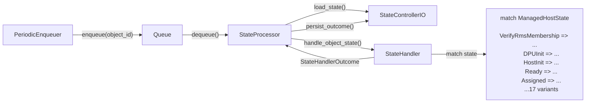
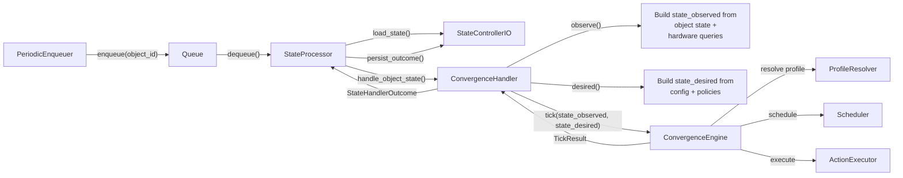
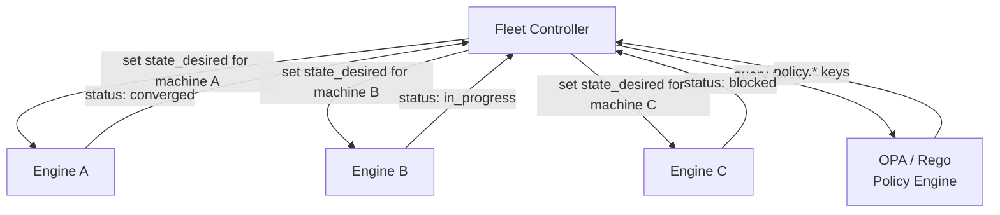

# Convergence Engine — Design Specification

**Status:** RFC  
**Authors:** Carbide Team  
**Last Updated:** 2026-04-02

---

## 1. Introduction

This document specifies a **declarative convergence engine** that replaces the imperative state-handler pattern used throughout Carbide today. Rather than encoding lifecycle transitions in hand-written `match` arms, the engine defines each possible action as a data-driven **operation** — a strongly-typed Rust definition declaring what state keys the action provides, under what preconditions (guards) it may fire, what resources it locks, and what effects it produces. A three-predicate scheduler then selects, on every reconciliation tick, the maximal non-conflicting subset of operations that constructively close the gap between *observed* and *desired* state.

### 1.1 Scope

The specification covers:

- The core concepts: state maps, delta, operations, guards, profiles, scheduling, and convergence (§3).
- Integration architecture with the existing `StateProcessor` / `StateControllerIO` infrastructure (§4).
- The Rust DSL profile system for defining operations (§5).
- Fleet-level coordination and external policy (OPA/Rego) (§6).
- Migration strategy from the current imperative handlers (§7).

### 1.2 Definitions


| Term                 | Definition                                                                                                |
| -------------------- | --------------------------------------------------------------------------------------------------------- |
| **state_observed**   | The ground-truth state of an object, periodically refreshed from hardware, database, or external sources. |
| **state_desired**    | The declared intent — the state the object should converge to.                                            |
| **delta**            | The set of state keys where observed and desired disagree.                                                |
| **operation**        | An atomic, data-driven unit of work defined by guards, effects, locks, and priority.                      |
| **guard**            | A boolean predicate over the observed state that must hold for an operation to fire.                      |
| **profile**          | A named collection of operations associated with a hardware type, supporting inheritance.                 |
| **tick**             | One iteration of the convergence loop: compute delta, select operations, execute, apply effects.          |
| **convergence**      | The system has converged when `delta` is empty.                                                           |


---

## 2. Problem Statement

### 2.1 Current Architecture

Carbide manages the lifecycle of bare-metal objects (machines, racks, switches, DPA interfaces, IB partitions, network segments, power shelves, and SPDM attestation devices) through a common framework:

1. `**StateControllerIO`** — a trait that abstracts database access for loading/persisting object state.
2. `**StateProcessor**` — a generic reconciliation loop that dequeues objects, loads their state, invokes a handler, and persists the outcome.
3. `**StateHandler**` — a trait whose `handle_object_state` method receives the current controller state and returns a `StateHandlerOutcome` (transition, wait, do-nothing, or deleted).

Each object type implements `StateHandler` with a `match` on its controller-state enum. The machine handler alone is over 10,000 lines with 17 top-level state variants, many of which contain nested sub-state machines.

### 2.2 Pain Points

1. **Scale of imperative code.** The machine handler file (`handler.rs`) is 10,257 lines. Adding a new hardware variant or firmware procedure means modifying deeply nested match arms.
2. **No separation of policy from mechanism.** The *what to do* (power on before firmware update) is interleaved with the *how to do it* (Redfish calls, retry logic). Testing a policy decision requires mocking the entire I/O layer.
3. **Rigid state ordering.** The enum-based state machine enforces a fixed transition graph. Reordering steps (e.g., skipping BIOS configuration for a hardware type that does not need it) requires new variants or conditional branches.
4. **Hardware-specific branching.** Different GPU/NIC/DPU platforms require different procedures, but the branching is scattered across helper functions rather than isolated in declarative profiles.
5. **Difficulty of testing.** Unit-testing a single transition requires constructing the full `ManagedHostStateSnapshot`, all services, and the handler context. Integration tests are brittle and slow.
6. **Cross-handler consistency.** Eight different handlers (machine, rack, switch, IB partition, DPA interface, SPDM, network segment, power shelf) each implement the same pattern independently, with inconsistent error handling and lifecycle management.

### 2.3 Desired Properties


| Property        | Description                                                                                                   |
| --------------- | ------------------------------------------------------------------------------------------------------------- |
| **Declarative** | Operations are defined via a type-safe Rust DSL — compile-time checked, IDE-discoverable, refactorable.       |
| **Extensible**  | Adding hardware support means adding a profile module with operation definitions — no changes to engine code. |
| **Testable**    | Policy (which operations fire in which order) is testable independently of I/O.                               |
| **Convergent**  | The engine guarantees progress toward desired state and detects deadlocks.                                    |
| **Safe**        | Resource locks and anti-oscillation guards prevent conflicting or cyclic actions.                             |


---

## 3. How the Engine Works

This section explains the core concepts of the convergence engine.

### 3.1 State: Two Maps

The engine works with two key-value maps:

- **state_observed** — what the hardware actually looks like right now: power status, firmware versions, agent heartbeats, BIOS settings hashes, etc. Refreshed every reconciliation cycle from Redfish, IPMI, databases, and agent reports.
- **state_desired** — what the hardware *should* look like: the firmware version we want, the BIOS hash we expect, the DPU mode we need, etc. Assembled at runtime from operator intent, config templates, firmware manifests, and fleet policies.

Both maps use the same set of strongly-typed keys (the `StateKey` enum — see §5). Any key can appear in either map. Which keys appear in `state_desired` is a runtime decision, not a property of the key itself.

In code: `HostState` is a `BTreeMap<StateKey, StateValue>`. Keys are enum variants (compile-time safe, zero-cost, impossible to misspell). Values are a typed union (`Bool`, `Int`, `Str`, `Version`) with cross-type equality.

### 3.2 Delta: What Needs to Change

The **delta** is the set of keys where observed and desired disagree. If the desired state says `FirmwareBmcVersion = "2.4.0"` but the observed state shows `FirmwareBmcVersion = "2.3.1"`, that key is in the delta.

The engine only looks at keys that appear in the desired state. Observed keys with no desired counterpart are ignored — `state_desired` is a patch, not a complete specification. If a desired key has not been observed yet (the hardware hasn't reported it), it's treated as mismatched.

**The system has converged when the delta is empty** — every key the desired state cares about matches what we observe.

### 3.3 Operations: What the Engine Can Do

An **operation** is an atomic unit of work, defined by six fields:

| Field | What it does |
|---|---|
| **id** | Unique name (e.g., `update_bmc_firmware`). |
| **provides** | Which state keys this operation can change. The engine only considers an operation if it provides a key in the current delta. |
| **guard** | A precondition that must be true before the operation can fire (e.g., "power must be on"). |
| **locks** | Resources this operation needs exclusive access to. Two operations that lock the same resource cannot run in the same tick. |
| **effects** | What the operation does to the state map after execution (e.g., sets `FirmwareBmcVersion` to the desired version). |
| **priority** | Higher priority operations are scheduled first when multiple compete. |

Operations are declared in Rust via the `op!` macro (see §5).

### 3.4 Guards: When Can an Operation Fire

Guards are boolean preconditions built from a small set of combinators:

- `eq(key, value)` — key equals value
- `neq(key, value)` — key does not equal value
- `contains(key, substring)` — key's value contains a substring
- `and(...)`, `or(...)`, `not(...)` — boolean combinators
- `desired(key)` — a reference to the desired-state value for that key

**Example:** a firmware update guard reads "fire only when the machine is powered on AND the current BMC firmware version differs from the desired version":

```rust
guard: and(
    eq(PowerState, "on"),
    neq(FirmwareBmcVersion, desired(FirmwareBmcVersion)),
),
```

The `desired(key)` reference lets operations compare against targets without hard-coding values. At evaluation time, `desired(FirmwareBmcVersion)` resolves to whatever version the operator declared as the target.

### 3.5 Hardware Profiles and Inheritance

A **hardware profile** is a named collection of operations for a specific hardware type. Profiles have:

- A **match rule** — a guard evaluated against observed state to auto-detect hardware (e.g., `contains(HwSku, "GB300")`).
- An **inherits** list — parent profiles whose operations are pulled in.
- **Operations** — the operations specific to this profile.
- An **abstract** flag — if true, the profile can only be inherited from, not directly matched.

**Inheritance** works like class inheritance: a child profile gets all its parents' operations. If a child defines an operation with the same ID as a parent, the child's version wins (last-writer-wins). This lets a specific hardware profile override just the operations that differ.

**Example chain:**

```
common                    (base operations: power_on, power_off, configure_bios, ...)
  └── nvidia_gbx00_base   (abstract: NVIDIA-specific firmware update)
        └── nvidia_gb300   (concrete: match rule checks HwSku contains "GB300")
              inherits: [nvidia_bf3_dpu]  ← also pulls in DPU operations
```

### 3.6 Three-Predicate Scheduler

The scheduler is the decision-making core. Every tick, it filters all available operations through three questions:

1. **Relevant?** Does the operation provide a key that's in the current delta? If not, skip it — there's nothing for it to do.
2. **Constructive?** Would the operation's effects move the state *toward* desired, not away from it? This prevents, e.g., `power_off` from firing when the desired state is "on".
3. **Ready?** Does the operation's guard pass on the current observed state? If not, the operation is blocked and goes to dependency resolution.

Operations that pass all three filters are **candidates**. The scheduler then picks a maximal non-conflicting subset using a greedy algorithm: sort by priority (highest first), and skip any operation whose locks overlap with an already-selected operation.

Equal-priority ties are broken by stable sort order (deterministic, typically alphabetical by operation ID).

### 3.7 Dependency Resolution

When an operation is relevant and constructive but **not ready** (its guard fails), the engine tries to find an **enabler** — another operation that can satisfy the unmet precondition.

**Example:** `update_bmc_firmware` needs `PowerState = "on"`, but the machine is off. The resolver finds `power_on`, whose effect sets `PowerState` to `"on"` and whose guard (`PowerState = "off"`) currently holds. It auto-schedules `power_on` as a dependency.

Dependency resolution works to **depth 1** — it finds direct enablers but doesn't recursively resolve chains. Deeper chains resolve naturally over multiple ticks (power on this tick → firmware update next tick → ...).

### 3.8 Anti-Oscillation

Without safeguards, the engine could get stuck in cycles — `power_on` and `power_off` alternating every tick. Two guards prevent this:

1. **Dominance deferral.** If operation A is scheduled as a dependency (e.g., `power_on` for `update_firmware`), and operation B would undo A's effect (e.g., `power_off`), then B is deferred. Dependencies win.

2. **Competitor blocking.** If two operations share a resource lock and one would break the other's guard, the disruptive one is deferred.

These guards prevent the most common 1-tick and 2-tick oscillation patterns. They are **not a formal proof of termination** — complex circular dependencies across 3+ ticks could theoretically occur. As a safety net, the engine can track visited-state fingerprints and detect recurring states.

In a well-configured operation set, the engine converges in roughly `|delta| × depth` ticks, where `|delta|` is the initial number of mismatched keys and `depth` is the maximum dependency chain depth.

### 3.9 The Convergence Loop

The engine runs as a **synchronous tick function**. The outer loop is the existing `PeriodicEnqueuer` → `Queue` → `StateProcessor` pipeline (see §4.2), which already handles periodic scheduling, dequeuing, and state persistence. Each tick:

1. Compute the delta between observed and desired state.
2. If the delta is empty → **converged**, done.
3. Filter operations through the three predicates (relevant, constructive, ready).
4. Resolve dependencies for blocked operations.
5. Schedule a non-conflicting subset, respecting locks and anti-oscillation.
6. Execute the selected operations and apply their effects to the observed state.
7. If no operations were selected but the delta is non-empty → **deadlock or waiting for external change**.

The converged state is a **fixpoint** — a state where running the engine again produces no changes. The engine seeks this fixpoint iteratively, tick by tick.

**Long-running operations** (like firmware flashes) are handled by the outer loop, not the engine itself. The operation initiates the flash; subsequent ticks re-observe the state and detect when it completes. The engine is always a pure synchronous function — the async boundary lives outside.

> **Full formal specification:** For the complete mathematical definitions, set-theoretic notation, guard algebra grammar, scheduling algorithm pseudocode, and termination analysis, see [Formal Model](formal-model.md).
---

## 4. Architecture

### 4.1 Current Architecture

The current system uses the `StateProcessor` generic reconciliation loop with per-type `StateHandler` implementations:




Each handler (`MachineStateHandler`, `RackStateHandler`, etc.) contains imperative code that directly calls Redfish, database, and other services inside `match` arms.

### 4.2 Proposed Architecture

The convergence engine replaces the per-type `StateHandler` implementations with a generic `ConvergenceHandler` that delegates all decision-making to the engine:




**What stays the same:**

- `StateProcessor`, `StateControllerIO`, the queue infrastructure, `PeriodicEnqueuer`, metrics, and state history — all unchanged.
- The `StateHandler` trait is still implemented, but by `ConvergenceHandler` rather than per-type handlers.

**What changes:**

- The `match` arms disappear. Decision-making moves into profile modules evaluated by the scheduler.
- Hardware-specific logic moves into per-profile Rust modules (one per hardware type).
- The `observe()` and `desired()` functions replace the monolithic state snapshot with a flat key-value map.

### 4.3 Component Responsibilities


| Component              | Responsibility                                                                                                                                         |
| ---------------------- | ------------------------------------------------------------------------------------------------------------------------------------------------------ |
| **ConvergenceHandler** | Implements `StateHandler`. Builds `state_observed` and `state_desired` from the object state, delegates to the engine, and maps `TickResult` back to `StateHandlerOutcome`. |
| **ConvergenceEngine**  | Orchestrates one tick: resolves profile, runs scheduler, executes actions, returns result.                                                             |
| **ProfileResolver**    | Loads hardware profiles from Rust profile modules, evaluates match rules, resolves inheritance chain, returns the effective operation set.             |
| **Scheduler**          | Implements the three-predicate filter, dependency resolution, anti-oscillation guards, and greedy selection.                                           |
| **ActionExecutor**     | Trait for executing operation steps. Concrete implementations call Redfish, database APIs, shell commands, etc.                                        |


---

## 5. Rust DSL Profile System

### 5.1 Module Layout

Profiles are Rust modules — compile-time checked, IDE-discoverable, and refactorable.

```
profiles/
├── mod.rs                     # Re-exports all profiles, provides all_profiles()
├── common.rs                  # Base operations inherited by all profiles
├── generic_x86.rs             # Generic x86 server profile
├── nvidia_gbx00_base.rs       # Abstract base for NVIDIA GBx00 series
├── nvidia_gb300.rs            # Concrete profile for GB300
└── nvidia_bf3_dpu.rs          # Abstract DPU profile (inherited by GB300)
```

### 5.2 State Keys and Resources as Enums

State keys and resource identifiers are **enum variants**.

```rust
#[derive(Clone, Copy, Debug, PartialEq, Eq, Hash)]
pub enum StateKey {
    // Power
    PowerState,
    PowerCycleCompleted,
    // Firmware — real version strings from hardware
    FirmwareBmcVersion,
    FirmwareBiosVersion,
    FirmwareHostVersion,
    DpuFirmwareVersion,
    // DPU — real observables, not boolean flags
    DpuCount,                 // number of DPUs discovered (0 = not yet discovered)
    DpuInterfaceIp,           // DPU interface IP address (empty = not configured)
    DpuMode,                  // "dpu", "nic", "" (empty = not set)
    DpuAgentVersion,          // DPU agent version (empty = not connected)
    DpuNetworkConfigVersion,
    // Host agent — real data from the agent
    ScoutVersion,             // scout agent version (empty = not installed)
    ScoutHeartbeat,           // "alive", "stale" — from continuous pings
    // BIOS / Network / Security
    BiosSettingsHash,         // hash of current BIOS attributes
    NetworkConfigVersion,
    LockdownEnabled,
    // Registration
    RmsInventoryId,           // RMS inventory ID (empty = not registered)
    HwSku,
    // Validation / Attestation
    ValidationResult,         // "passed", "failed", "not_run"
    BomValidationResult,      // "passed", "failed", "not_run"
    AttestationStatus,
    // Cleanup — real observable state
    DriveEraseStatus,         // "erased", "not_erased"
    // Instance / Lifecycle
    InstanceAssigned,
    LifecycleDeleted,
    // ...

    // Parameterized variants for per-device state (SPDM)
    AttestationDeviceMetadataFetched(usize),
    AttestationDeviceCertificateFetched(usize),
    AttestationDeviceVerified(usize),
    AttestationDeviceAppraised(usize),
    AttestationDeviceStatus(usize),
}

#[derive(Clone, Copy, Debug, PartialEq, Eq, Hash)]
pub enum Resource {
    Power,
    Firmware,
    Dpu,
    DpuDiscovery,
    Rms,
    Scout,
    Validation,
    Attestation,
    AttestationDevice(usize),
    Lockdown,
    Network,
    Bios,
    Cleanup,
    Lifecycle,
    // ...
}
```

### 5.3 Operation Macro — `op!`

Operations are declared via the `op!` macro:

```rust
op!(update_bmc_firmware {
    provides: [FirmwareBmcVersion],
    guard: and(
        eq(PowerState, "on"),
        neq(FirmwareBmcVersion, desired(FirmwareBmcVersion)),
    ),
    locks: [Firmware, Power],
    effects: [FirmwareBmcVersion => desired(FirmwareBmcVersion)],
    steps: [
        action(redfish_firmware_update, target = "bmc"),
        action(wait_for_bmc_ready, timeout_seconds = 600),
    ],
    priority: 80,
});
```

The macro expands to a function `fn update_bmc_firmware() -> Operation` with all types resolved from the enum variants. Inside the macro body:

- Bare identifiers like `PowerState` resolve to `StateKey::PowerState`
- `desired(X)` creates a desired-state reference for key `X`
- `and(...)`, `eq(...)`, `neq(...)`, `contains(...)` map to `Guard` enum variants
- `Firmware`, `Power` resolve to `Resource::Firmware`, `Resource::Power`
- `effects` use `=>` syntax for key-value pairs

A simple operation with a trivial guard:

```rust
op!(power_on {
    provides: [PowerState],
    guard: eq(PowerState, "off"),
    locks: [Power],
    effects: [PowerState => "on"],
    steps: [
        action(redfish_power_on),
        action(wait_for_power_state, target = "on", timeout_seconds = 120),
    ],
    priority: 100,
});
```

### 5.4 Profile Macro — `profile!`

Profiles are declared with a similar macro:

```rust
profile!(nvidia_gb300 {
    match_rule: contains(HwSku, "GB300"),
    inherits: [NvidiaGbx00Base, NvidiaBf3Dpu],
    operations: [power_off_gb300],
});
```

### 5.5 Desired-State References

The `desired(X)` syntax inside `op!` creates a reference to the corresponding desired-state value. At evaluation time, `desired(FirmwareBmcVersion)` resolves to whatever firmware version the operator has declared as the target.

---

## 6. Fleet Coordination

The convergence engine operates at the level of a single object (one machine, one switch, etc.). Fleet-level coordination — managing rollouts across multiple objects — requires a layer above the engine.

### 6.1 Fleet Controller

A **Fleet Controller** sits above the per-object convergence engines and manages:

- **Phased rollouts:** Update firmware on 10% of machines, validate, then proceed to the next batch.
- **Rolling updates:** Ensure at least N machines per rack remain healthy during updates.
- **Cross-object barriers:** All DPUs in a rack must reach firmware version X before any host proceeds to the next phase.

The fleet controller does not modify the engine — it controls the *desired state* fed to each engine instance:




### 6.2 External Policy Integration

Cross-machine constraints (e.g., "at most 5 machines per location may be updating firmware simultaneously") are expressed as **OPA/Rego policies**. See [External Policy — OPA / Rego](rego-opa.md) for the full specification.

The integration point is simple: before each tick, the fleet controller (or a policy sidecar) queries OPA and injects the resulting decisions as `policy.`* keys into the observed state. Guards in operation definitions reference these keys naturally:

```rust
guard: and(
    eq(PowerState, "on"),
    eq(PolicyFirmwareUpdateAllowed, "true"),
),
```

No engine code changes are needed — policy decisions are just `StateKey` variants like any other.

---

## 7. Migration Strategy

The convergence engine and the current handlers produce fundamentally different outputs — the handler returns a single `StateHandlerOutcome` (transition, wait, do-nothing), while the engine returns a set of operations with state effects. Per-tick comparison is not meaningful. Migration relies on end-state validation, decision logging, and incremental cutover.

### 7.1 End-State Validation

Before any production deployment, batch-test the engine against known-good production state snapshots:

1. Take a real object's current state from the production database.
2. Build `state_observed` and `state_desired` from the object's state, config, and firmware manifests.
3. Run the engine to convergence with mock action executors (no real Redfish/DB calls).
4. Verify the final `state_observed` matches the state the current handler would eventually produce.

This validates the engine's *policy* — does it reach the same end state? — without comparing intermediate tick-by-tick decisions. A test harness runs this against hundreds of production state snapshots per profile to build statistical confidence.

### 7.2 Per-Profile Cutover

Route objects to the engine per-profile via feature flags, starting with the simplest:

1. `**power_shelf*`* — 3 operations, linear lifecycle, placeholder logic. Ideal first candidate.
2. `**network_segment**` — 3 operations, simple two-phase deletion.
3. `**rack**` — 4 operations, straightforward discovery/validation.
4. `**switch**`, `**ib_partition**` — moderate complexity.
5. `**dpa_interface**`, `**spdm**` — higher complexity with multi-phase flows.
6. `**machine**` — last, largest, most complex. 18+ operations, multi-profile inheritance.

Each step is a real cutover for that profile — the old handler stops running for those objects, and the engine takes over. The feature flag enables instant rollback if issues arise.

### 7.3 Rollback Safety

Old handler code remains behind the feature flag throughout the migration:

1. If the engine misbehaves for a profile, flip the flag to route objects back to the old handler.
2. Old handlers are only removed after sustained production confidence (weeks/months per profile).
3. The `StateHandler` trait remains — `ConvergenceHandler` becomes its sole implementation only after all profiles are validated and old code is retired.

### 7.4 Design Principle: Properties, Not Phases

The convergence engine's power comes from modeling **what properties an entity should have**, not **what lifecycle phases it should traverse**. This distinction is fundamental.

**Anti-pattern: FSM in disguise.** A naive migration from imperative handlers wraps each FSM state transition as an operation:

```
verify_rms_membership → discover_dpus → initialize_dpu → initialize_host → validate → ...
```

This preserves the sequential pipeline of the FSM. Operations like `initialize_host` are lifecycle phases that *bundle* unrelated concerns (configure BIOS, configure network, install agent, verify reachability). The guards replicate the FSM ordering. The engine is doing extra work to arrive at the same rigid execution order the FSM already had.

**Correct approach: property-oriented operations.** Each operation manages a single, independently configurable property:

```
configure_bios:         provides BiosSettingsHash,       guard: PowerState = "on"
configure_network:      provides NetworkConfigVersion,   guard: PowerState = "on"
install_scout:          provides ScoutVersion,           guard: PowerState = "on"
update_bmc_firmware:    provides FirmwareBmcVersion,     guard: PowerState = "on"
enable_lockdown:        provides LockdownEnabled,        guard: PowerState = "on"
```

There is no `initialize_host` operation — that was an FSM bucket. The engine sees that `BiosSettingsHash` differs from desired and schedules `configure_bios`; that `ScoutVersion` is empty and schedules `install_scout`. These may run in parallel or in dependency order, determined by guards, not by a hardcoded phase sequence.

**Corollary: real observables, not boolean flags.** State keys should hold **real observable data**, not boolean step-completion flags. A boolean like `ScoutInstalled = "true"` is a phase marker in disguise — it records "we completed this step" rather than reflecting ground truth. Prefer:

| Anti-pattern (boolean flag) | Correct (real observable) | Why |
|---|---|---|
| `ScoutInstalled = "true"` | `ScoutVersion = "3.2.1"` | If you can observe the version, the agent is installed. The value comes from the deployment manifest. |
| `DpuDiscovered = "true"` | `DpuCount = "2"` | If you know how many DPUs exist, you've discovered them. |
| `DpuModeSet = "true"` | `DpuMode = "dpu"` | The actual mode. Observable via Redfish. |
| `DpuAgentConnected = "true"` | `DpuAgentVersion = "1.4.0"` | If the agent reports its version, it's connected. |
| `HostReachable = "true"` | `ScoutHeartbeat = "alive"` | Continuously observed from agent pings. Reflects *current* state, not a one-time check. |
| `RmsRegistered = "true"` | `RmsInventoryId = "rms-12345"` | The actual RMS inventory ID. If it exists, the host is registered. |
| `BiosSettingsApplied = "true"` | `BiosSettingsHash = "a3f8c2"` | Hash of current BIOS attributes. Desired = hash from the config template. Drift is detectable. |

Real observables give you **free self-healing**: if the DPU agent crashes, `DpuAgentVersion` goes empty on the next observation. The engine detects the delta and acts. With a boolean flag, `DpuAgentConnected` stays `"true"` until something explicitly clears it.

Real observables also eliminate meaningless desired state. `DpuDiscovered = "true"` is a boolean flag that tells you nothing. `DpuCount = "2"` tells you the ground truth, and any key -- including `DpuCount` -- can be placed in desired state when the composition layer needs it.

**Why this matters:**

1. **Self-healing.** If BIOS settings drift on a machine that's been "ready" for months, the engine detects `BiosSettingsHash` has changed and runs `configure_bios` directly — without re-entering an "init" phase.
2. **Reprovisioning disappears.** "Reprovision" in the FSM model is a phase that re-runs init steps. In the convergence model, you change the desired firmware version and the engine converges to it. There is no reprovisioning operation — just desired state changing.
3. **Maximal parallelism.** The FSM forces `init → validation → ready`. The engine parallelizes everything whose guards are satisfied — BIOS, network, agent install, and firmware update can all run concurrently if power is on.
4. **Hardware variance is trivial.** A profile for hardware that doesn't need BIOS configuration simply omits `configure_bios`. No conditional branches, no "skip this phase" logic.
5. **Continuous observation.** Real observables like `ScoutHeartbeat` and `DpuAgentVersion` are refreshed every reconciliation tick. The state reflects current reality, not a historical record of completed steps.

**Guards express physical constraints, not lifecycle ordering.** The only valid guard predicates are real hardware constraints:

- Can't flash firmware if power is off → `guard: eq(PowerState, "on")`
- Can't install scout if network isn't configured → `guard: eq(NetworkConfigVersion, desired(NetworkConfigVersion))`
- Can't configure DPU network without agent → `guard: neq(DpuAgentVersion, "")`
- Can't run two firmware flashes at once → `locks: [Firmware]`

The FSM's phase ordering (init before validation before ready) is artificial — it exists because someone had to manually decide the order. The convergence engine makes that unnecessary.

---

## 8. Open Questions


| Question                     | Discussion                                                                                                                                                                                  |
| ---------------------------- | ------------------------------------------------------------------------------------------------------------------------------------------------------------------------------------------- |
| **Formal termination proof** | The anti-oscillation guards prevent common patterns but are not a formal proof. Should we invest in a model-checker (e.g., TLA+) to verify termination for specific profile configurations? |
| **State persistence format** | Should `state_observed` and `state_desired` be persisted as flat key-value maps in the database, or reconstructed each tick from the existing model structs?                                 |
| **Guard expressiveness**     | Is the current guard algebra sufficient, or do we need arithmetic comparisons (e.g., `firmware.version >= "2.0"`)?                                                                          |


---

## Appendix: Companion Documents

- [Formal Model](formal-model.md) — Complete mathematical specification with set-theoretic notation, guard algebra grammar, scheduling algorithm, and termination analysis.
- [External Policy — OPA / Rego](rego-opa.md) — Cross-machine constraints and fleet coordination policies

The following documents tries map each existing state handler to the convergence engine model:

- [Machine Handler](machine.md) — `ManagedHostState` variants
- [Rack Handler](rack.md) — 7 `RackState` variants
- [Switch Handler](switch.md) — 9 `SwitchControllerState` variants
- [IB Partition Handler](ib-partition.md) — 4 `IBPartitionControllerState` variants
- [DPA Interface Handler](dpa-interface.md) — 9 `DpaInterfaceControllerState` variants
- [SPDM / Attestation Handler](spdm.md) — 6+5 `AttestationState` + `AttestationDeviceState` variants
- [Network Segment Handler](network-segment.md) — 3 `NetworkSegmentControllerState` variants
- [Power Shelf Handler](power-shelf.md) — 6 `PowerShelfControllerState` variants
