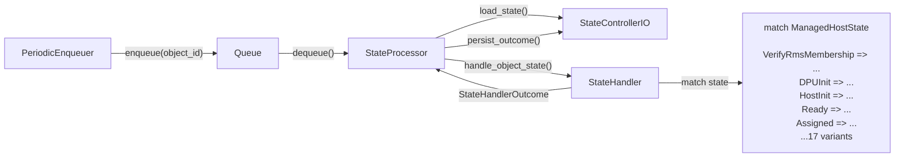
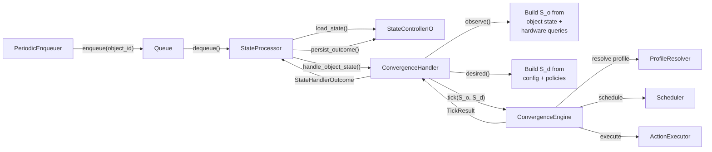
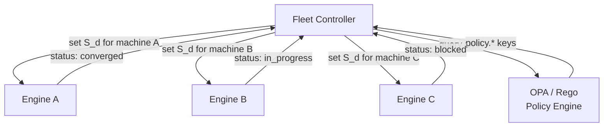

# Convergence Engine — Design Specification

**Status:** RFC  
**Authors:** Carbide Team  
**Last Updated:** 2026-04-02

---

## 1. Introduction

This document specifies a **declarative convergence engine** that replaces the imperative state-handler pattern used throughout Carbide today. Rather than encoding lifecycle transitions in hand-written `match` arms, the engine defines each possible action as a data-driven **operation** — a strongly-typed Rust definition declaring what state keys the action provides, under what preconditions (guards) it may fire, what resources it locks, and what effects it produces. A three-predicate scheduler then selects, on every reconciliation tick, the maximal non-conflicting subset of operations that constructively close the gap between *observed* and *desired* state.

### 1.1 Scope

The specification covers:

- The formal state model and delta computation.
- The operation data model, guard algebra, and effect resolution.
- The hardware-profile system with inheritance.
- The three-predicate scheduler, dependency resolution, and anti-oscillation guards.
- The convergence loop and fixpoint characterization.
- Integration architecture with the existing `StateProcessor` / `StateControllerIO` infrastructure.
- The Rust DSL profile system for defining operations.
- Fleet-level coordination and external policy (OPA/Rego).
- Migration strategy from the current imperative handlers.

### 1.2 Definitions


| Term                       | Definition                                                                                                |
| -------------------------- | --------------------------------------------------------------------------------------------------------- |
| **Observed state** (`S_o`) | The ground-truth state of an object, periodically refreshed from hardware, database, or external sources. |
| **Desired state** (`S_d`)  | The declared intent — the state the object should converge to.                                            |
| **Delta** (`Δ`)            | The set of state keys where observed and desired disagree.                                                |
| **Operation** (`ω`)        | An atomic, data-driven unit of work defined by guards, effects, locks, and priority.                      |
| **Guard** (`G`)            | A boolean predicate over the observed state that must hold for an operation to fire.                      |
| **Profile**                | A named collection of operations associated with a hardware type, supporting inheritance.                 |
| **Tick**                   | One iteration of the convergence loop: compute delta, select operations, execute, apply effects.          |
| **Convergence**            | The system has converged when `Δ = ∅`.                                                                    |


---

## 2. Problem Statement

### 2.1 Current Architecture

Carbide manages the lifecycle of bare-metal objects (machines, racks, switches, DPA interfaces, IB partitions, network segments, power shelves, and SPDM attestation devices) through a common framework:

1. `**StateControllerIO`** — a trait that abstracts database access for loading/persisting object state.
2. `**StateProcessor**` — a generic reconciliation loop that dequeues objects, loads their state, invokes a handler, and persists the outcome.
3. `**StateHandler**` — a trait whose `handle_object_state` method receives the current controller state and returns a `StateHandlerOutcome` (transition, wait, do-nothing, or deleted).

Each object type implements `StateHandler` with a `match` on its controller-state enum. The machine handler alone is over 10,000 lines with 17 top-level state variants, many of which contain nested sub-state machines.

### 2.2 Pain Points

1. **Scale of imperative code.** The machine handler file (`handler.rs`) is 10,257 lines. Adding a new hardware variant or firmware procedure means modifying deeply nested match arms.
2. **No separation of policy from mechanism.** The *what to do* (power on before firmware update) is interleaved with the *how to do it* (Redfish calls, retry logic). Testing a policy decision requires mocking the entire I/O layer.
3. **Rigid state ordering.** The enum-based state machine enforces a fixed transition graph. Reordering steps (e.g., skipping BIOS configuration for a hardware type that does not need it) requires new variants or conditional branches.
4. **Hardware-specific branching.** Different GPU/NIC/DPU platforms require different procedures, but the branching is scattered across helper functions rather than isolated in declarative profiles.
5. **Difficulty of testing.** Unit-testing a single transition requires constructing the full `ManagedHostStateSnapshot`, all services, and the handler context. Integration tests are brittle and slow.
6. **Cross-handler consistency.** Eight different handlers (machine, rack, switch, IB partition, DPA interface, SPDM, network segment, power shelf) each implement the same pattern independently, with inconsistent error handling and lifecycle management.

### 2.3 Desired Properties


| Property        | Description                                                                                                   |
| --------------- | ------------------------------------------------------------------------------------------------------------- |
| **Declarative** | Operations are defined via a type-safe Rust DSL — compile-time checked, IDE-discoverable, refactorable.       |
| **Extensible**  | Adding hardware support means adding a profile module with operation definitions — no changes to engine code. |
| **Testable**    | Policy (which operations fire in which order) is testable independently of I/O.                               |
| **Convergent**  | The engine guarantees progress toward desired state and detects deadlocks.                                    |
| **Safe**        | Resource locks and anti-oscillation guards prevent conflicting or cyclic actions.                             |


---

## 3. Formal Model

This section provides the complete mathematical specification of the convergence engine. Each subsection defines a concept with formal notation, explains it in prose, and maps it to the corresponding Rust data structure.

### 3.1 State Space

**Definition.** Let `K` be a finite set of *state keys* — strongly-typed identifiers such as `PowerState`, `FirmwareBmcVersion`, or `BiosBootOrder`. Let `V` be a set of *state values* — a typed union of booleans, integers, semantic versions, and text. All keys, values, identifiers, and resources are strongly typed; the implementation represents `K` and `R` as enums (`StateKey`, `Resource`) and values as a typed union (`StateValue`), preventing accidental misuse at compile time.

A **host state** is a partial function:

```
S : K ⇀ V
```

The notation `⇀` (as opposed to `→`) indicates that `S` need not be defined on all of `K`. The **domain** of `S` is:

```
dom(S) = { k ∈ K | S(k) is defined }
```

At any moment in time, the system maintains two states:

- `S_o` — the **observed state**, populated by reading hardware (Redfish, IPMI), databases, and agent reports. This is the ground truth, refreshed periodically.
- `S_d` — the **desired state**, assembled at runtime by the desired-state composition layer from operator intent, config templates, firmware manifests, fleet policies, and other sources.

**Unified key space.** Both `S_o` and `S_d` draw from the same key space `K`. There is no type-level distinction between "observed-only" and "desired" keys -- any key can appear in either or both maps. Which keys appear in `S_d` is a runtime decision made by the composition layer, not a property of the key itself.

**Domain relationship.** The desired state typically declares a subset of observed keys, but this is not a constraint:

```
dom(S_d) ⊆ K,  dom(S_o) ⊆ K
```

`dom(S_d) \ dom(S_o)` may be non-empty when the observed state has not yet discovered a key that the desired state declares. Such keys are treated as mismatched (see §3.2).

**Code mapping.** `K` is represented as a `StateKey` enum — each valid key is a variant, making it `Copy`, zero-cost, and impossible to misspell. `V` is a `StateValue` enum supporting cross-variant equality (e.g., `Bool(true)` equals the text representation `"true"`). `S` is `HostState(BTreeMap<StateKey, StateValue>)`.

### 3.2 Delta

**Definition.** The **delta** (or *drift*) between observed and desired state is the set of keys where the two states disagree:

```
Δ(S_o, S_d) = { k ∈ dom(S_d) | S_o(k) ≠ S_d(k) }
```

with the convention that if `k ∈ dom(S_d) \ dom(S_o)` — i.e., the desired state declares a key that the observed state has not yet discovered — then `S_o(k) ≠ S_d(k)` holds (the key is considered mismatched). Formally:

```
k ∈ Δ  ⟺  k ∈ dom(S_d) ∧ ( k ∉ dom(S_o) ∨ S_o(k) ≠ S_d(k) )
```

**Convergence criterion.** The system has **converged** when:

```
Δ(S_o, S_d) = ∅
```

That is, for every key the desired state cares about, the observed state agrees.

**What the delta does NOT include.** Keys in `dom(S_o) \ dom(S_d)` — observed keys with no corresponding desired value — are not part of the delta. The engine does not attempt to "clean up" observed state that has no desired counterpart. This is intentional: `S_d` is a *patch*, not a complete specification.

**Code mapping.** The `delta()` function iterates over `dom(S_d)` and collects keys where `observed.get(k) != Some(desired_val)`.

### 3.3 Operations

**Definition.** An **operation** is a tuple:

```
ω = (id, P, G, L, E, π)
```

where:


| Component | Constraint       | Description                                                                                                                                                                         |
| --------- | ---------------- | ----------------------------------------------------------------------------------------------------------------------------------------------------------------------------------- |
| `id`      | unique in `Ω`    | Unique identifier for this operation.                                                                                                                                               |
| `P`       | `P ⊆ K`          | **Provides** — the set of state keys this operation can change. An operation is only considered for a delta key `k` if `k ∈ P`.                                                     |
| `G`       | `G : S → {0, 1}` | **Guard** — a boolean predicate over the observed state (see §3.4). The operation may only fire when `G(S_o) = 1`.                                                                  |
| `L`       | `L ⊆ R`          | **Locks** — a set of resource identifiers requiring mutual exclusion. `R` is the universe of lockable resources. Two operations with `L₁ ∩ L₂ ≠ ∅` cannot execute in the same tick. |
| `E`       | `E : K ⇀ V`      | **Effects** — a partial function mapping state keys to their post-execution values. After execution, `S_o(k) ← E(k)` for each `k ∈ dom(E)`.                                         |
| `π`       | `π ∈ ℕ`          | **Priority** — a non-negative integer. Higher values are scheduled first when multiple operations compete.                                                                          |


**Note on effects and provides.** Typically `dom(E) ⊆ P`, but this is not strictly required. An operation may have effects on keys it does not "provide" (side effects), though this is discouraged as it complicates reasoning.

### 3.4 Guard Algebra

Guards are the precondition language of the engine. They form a small algebra closed under boolean combinators.

**Grammar.** The set of guard expressions `G` is defined inductively:

```
G ::= Eq(k, v)
    | Neq(k, v)
    | In(k, {v₁, …, vₙ})
    | Contains(k, s)
    | And(G₁, …, Gₙ)
    | Or(G₁, …, Gₙ)
    | Not(G)
    | True
```

**Evaluation semantics.** Given a state `S`, each guard variant evaluates as follows:


| Guard            | `G(S) = 1` iff                            |
| ---------------- | ----------------------------------------- |
| `Eq(k, v)`       | `k ∈ dom(S) ∧ S(k) = resolve(v, S)`       |
| `Neq(k, v)`      | `k ∉ dom(S) ∨ S(k) ≠ resolve(v, S)`       |
| `In(k, V)`       | `k ∈ dom(S) ∧ S(k) ∈ V`                   |
| `Contains(k, s)` | `k ∈ dom(S) ∧ s` is a substring of `S(k)` |
| `And(G₁, …)`     | `∀ i : Gᵢ(S) = 1`                         |
| `Or(G₁, …)`      | `∃ i : Gᵢ(S) = 1`                         |
| `Not(G')`        | `G'(S) = 0`                               |
| `True`           | always 1                                  |


**Desired-state references.** Values `v` in guard and effect expressions may reference the desired state via `desired(k)`. The resolution function is:

```
resolve(v, S_o, S_d) =
    if v = desired(k'):
        return S_d(k')
    else:
        return v
```

This allows operations to compare observed values against desired targets (e.g., "current firmware version differs from desired") without hard-coding target values.

**Example.** The guard for a firmware update operation (shown here in `op!` macro syntax — see §5):

```rust
guard: and(
    eq(PowerState, "on"),
    neq(FirmwareBmcVersion, desired(FirmwareBmcVersion)),
),
```

This reads: "fire only when the machine is powered on AND the current BMC firmware version differs from the desired version."

**Conflict detection.** The function `conflicts_with_effect(G, k, v, S)` determines whether setting key `k` to value `v` in state `S` would cause guard `G` to transition from true to false. This is used by the anti-oscillation logic (§3.8):

```
conflicts_with_effect(G, k, v, S) = G(S) = 1  ∧  G(S[k ↦ v]) = 0
```

where `S[k ↦ v]` denotes the state `S` with key `k` overwritten to `v`.

**Code mapping.** The `Guard` type implements `evaluate(S) → {0, 1}` and `conflicts_with_effect(G, k, v, S) → {0, 1}` with strongly-typed key and value parameters.

### 3.5 Hardware Profiles and Inheritance

**Definition.** A **hardware profile** is a tuple:

```
P = (id, M, I, Ω, α)
```

where:


| Component | Constraint        | Description                                                                                                                              |
| --------- | ----------------- | ---------------------------------------------------------------------------------------------------------------------------------------- |
| `id`      | unique in `Π`     | Profile identifier (e.g., `nvidia_gb300`, `generic_x86`). `Π` is the set of all profiles.                                                |
| `M`       | `M : S → {0, 1}`  | **Match rule** — a guard expression evaluated against observed state. The first non-abstract profile whose match rule holds is selected. |
| `I`       | `I ⊆ Π`           | **Inherits** — an ordered list of parent profile identifiers.                                                                            |
| `Ω`       | `Ω = {ω₁, …, ωₘ}` | **Operations** — the set of operations defined in this profile.                                                                          |
| `α`       | `α ∈ {0, 1}`      | **Is abstract** — if 1, the profile cannot be directly selected but can be inherited from.                                               |


**Inheritance resolution.** The effective operation set for a profile `P` is computed by traversing the inheritance DAG in order and merging operations:

```
ops(P) = ops(P_I₁) ∪ ops(P_I₂) ∪ … ∪ Ω_P
```

When two profiles define an operation with the same `id`, the later definition wins (**last-writer-wins**). This allows a child profile to override a parent's operation — for example, `nvidia_gb300` can override the `power_off` operation inherited from `common` to add a GPU-specific shutdown sequence.

**Profile detection algorithm:**

```
function detect_profile(S_o, profiles):
    for P in profiles sorted by specificity:
        if P.is_abstract: continue
        if P.match_rule(S_o) = 1:
            return P
    return error("no matching profile")
```

**Concrete inheritance chain example:**

```
common                    (base operations: power_on, power_off, configure_bios, ...)
  └── nvidia_gbx00_base   (abstract: update_bmc_firmware with NVIDIA-specific Redfish)
        └── nvidia_gb300   (concrete: match rule checks hw_sku contains "GB300")
              inherits: [nvidia_bf3_dpu]  ← also pulls in DPU operations
```

The resolved operation set for a GB300 machine would be:

```
ops(gb300_resolved) = ops(common) ∪ ops(nvidia_gbx00_base) ∪ ops(nvidia_bf3_dpu) ∪ ops(nvidia_gb300)
```

### 3.6 Three-Predicate Scheduler

The scheduler is the decision-making core of the engine. On each tick, it evaluates every available operation against three predicates and selects a safe, non-conflicting action set.

**Predicate 1 — Relevant.** An operation is relevant if it provides at least one key in the current delta:

```
relevant(ω)  ⟺  P_ω ∩ Δ(S_o, S_d) ≠ ∅
```

Irrelevant operations are filtered out immediately. If the delta is empty, no operations are relevant and the system has converged.

**Predicate 2 — Constructive.** A relevant operation is constructive if at least one of its effects moves the observed state *toward* the desired state (not away from it):

```
constructive(ω)  ⟺  ∃ k ∈ P_ω ∩ Δ : resolve(E_ω(k), S_o) = S_d(k)
```

where `resolve` handles `desired.*` references in effect values. This predicate prevents operations that would change a delta key but to the *wrong* value — e.g., powering off when the desired state is powered on.

**Predicate 3 — Ready.** A constructive, relevant operation is ready if its guard holds on the current observed state:

```
ready(ω)  ⟺  G_ω(S_o) = 1
```

Operations that are relevant and constructive but not ready become candidates for dependency resolution (§3.7).

**Candidate set.** The set of fully qualified candidates is:

```
R = { ω | relevant(ω) ∧ constructive(ω) ∧ ready(ω) }
```

**Greedy resource-conflict-free selection.** From `R`, the scheduler selects a maximal subset that respects resource locks:

```
scheduled = greedy(R, π, L)
```

**Algorithm:**

```
function schedule(R):
    sort R by priority π descending (stable sort preserves insertion order for ties)
    claimed_resources ← ∅
    scheduled ← []

    for ω in R:
        if L_ω ∩ claimed_resources = ∅:
            if not anti_oscillation_deferred(ω):
                scheduled.append(ω)
                claimed_resources ← claimed_resources ∪ L_ω

    return scheduled
```

When two operations have equal priority, the stable sort preserves their original order (typically alphabetical by operation ID from the profile). This is deterministic but arbitrary — if tie-breaking matters, assign distinct priorities.

**Formal property.** The scheduled set satisfies:

```
∀ ωᵢ, ωⱼ ∈ scheduled, i ≠ j : Lᵢ ∩ Lⱼ = ∅
```

That is, no two scheduled operations hold the same resource lock.

### 3.7 Dependency Resolution

Some operations are relevant and constructive but not ready — their guard fails on the current observed state. The dependency resolver attempts to find **enabler** operations that can satisfy the unmet preconditions.

**Unmet clause extraction.** For a blocked operation `ω_b` with `G(ω_b)(S_o) = 0`, the resolver decomposes the guard into its atomic `Eq` clauses and identifies which ones fail:

```
unmet(ω_b) = { (k, v) | Eq(k, v) ∈ atoms(G(ω_b))  ∧  S_o(k) ≠ resolve(v, S_o) }
```

For compound guards (`And`, `Or`), the decomposition follows the structure: for `And`, all failing clauses are unmet; for `Or`, only the first satisfiable branch is considered.

**Enabler search.** For each unmet clause `(k, v)`, the resolver searches for an enabler operation:

```
∃ ω_e ∈ Ω : E_e(k) = v  ∧  G_e(S_o) = 1  ∧  L_e ∩ L_claimed = ∅
```

where `L_claimed` is the set of resources already reserved by previously scheduled operations and other enablers.

**Resource pre-reservation.** When an enabler is found, its resources are immediately added to `L_claimed` *before* the main greedy pass. This prevents the greedy pass from scheduling a different operation that would conflict with the enabler.

**Dependency chain depth.** The current implementation resolves dependencies to depth 1 — it finds enablers for blocked operations but does not recursively resolve enablers' own blocked dependencies. This is sufficient for common patterns (e.g., power-on enables firmware update) and avoids the complexity of recursive planning. The convergence loop naturally resolves deeper chains over multiple ticks.

**Example.** Operation `update_bmc_firmware` requires `power.state = "on"`. If the machine is off:

1. `update_bmc_firmware` is relevant and constructive but not ready (guard fails: `power.state = "off"`).
2. The resolver extracts unmet clause: `(power.state, "on")`.
3. It finds enabler `power_on` with effect `power.state → "on"`, whose guard `power.state = "off"` holds.
4. `power_on` is auto-scheduled; its resources are reserved.
5. After `power_on` executes, the next tick finds `update_bmc_firmware` ready.

### 3.8 Anti-Oscillation

Without safeguards, the scheduler could enter infinite cycles — for example, `power_on` and `power_off` alternating each tick because both are relevant to the same key. Two guards prevent the most common oscillation patterns.

**Guard 1 — Dominance deferral.** An operation `ω` is deferred if it would undo the effect of a dependency action scheduled in the same tick:

```
ω deferred if ∃ ω_d ∈ deps, k ∈ P_ω ∩ P_d : E_ω(k) ≠ E_d(k)
```

**Intuition.** If the scheduler found that `power_on` is needed as a dependency for `update_bmc_firmware`, and `power_off` is also relevant (because `PowerState` is in the delta), the dominance guard defers `power_off` — executing it would undo the dependency and create an oscillation.

**Guard 2 — Competitor blocking deferral.** An operation `ω` is deferred if its effect would falsify the guard of another ready operation that competes for the same resource:

```
ω deferred if ∃ ω_c ∈ R, L_ω ∩ L_c ≠ ∅ : conflicts_with_effect(G_c, k, E_ω(k), S_o) for some k
```

**Intuition.** If two operations share a resource lock and one would make the other's guard false, the engine defers the disruptive one, preferring the operation that preserves the conditions needed by its competitor.

**What these guards do NOT guarantee.** These two guards prevent the most common 1-tick and 2-tick oscillation patterns:

- Tick `t`: power on → Tick `t+1`: power off → Tick `t+2`: power on → ... (prevented by dominance)
- Tick `t`: operation A blocks operation B's guard, which in turn blocks A (prevented by competitor blocking)

However, they are **not a formal proof of termination**. In the general case:

1. **Longer cycles** (3+ ticks) could theoretically occur if the operation graph has complex circular dependencies.
2. **Energy function non-monotonicity.** Dependency resolution can *temporarily increase* `|Δ|` — e.g., powering on a machine adds `power.state = "on"` to observed state, which might not be the desired value if the ultimate goal is a firmware update with power-off afterward. The delta shrinks only after the full dependency chain completes.

**Safety net: visited-state detection.** As a defensive measure, the engine can optionally track visited state fingerprints (hashes of `S_o`) and detect if the same observed state recurs, indicating an oscillation. Upon detection, the engine halts and reports a misconfiguration error.

**Formal characterization.** Define the "energy" of the system as `|Δ(S_o, S_d)|`. In a well-configured operation set:

- Each constructive operation reduces `|Δ|` by at least 1 for its primary key.
- Dependency operations may temporarily increase `|Δ|` but are bounded in depth.
- The anti-oscillation guards ensure that the scheduler does not undo its own progress within a single tick.

Under these conditions, the convergence loop terminates in `O(|Δ₀| · d)` ticks, where `|Δ₀|` is the initial delta size and `d` is the maximum dependency chain depth.

### 3.9 Convergence Loop

The convergence loop is the top-level execution cycle of the engine. It repeatedly ticks until the system converges or declares a deadlock.

**State evolution.** After each tick, the observed state is updated:

```
S_o(t+1) = S_o(t) ⊕ ⋃{ E_ω | ω ∈ actions(t) }
```

where `⊕` denotes state update (overwriting existing keys with new values from the effects).

**Desired-state availability.** Both `S_o` and `S_d` are available to the scheduler on every tick. Guards and effects that use `desired(k)` references are resolved against `S_d` via the `resolve` function (see §3.4).

**Termination conditions.** The loop terminates when:

1. **Converged:** `Δ(S_o, S_d) = ∅`. All desired keys match observed values.
2. **Idle with non-empty delta:** The scheduler returns no actions (`actions(t) = ∅`) but `Δ ≠ ∅`. This indicates either a misconfiguration (no operation provides the needed key), a deadlock (all relevant operations are blocked by guards that cannot be satisfied), or a transient condition awaiting external state changes.

**Fixpoint characterization.** The converged state `S_o`* is a **fixpoint** of the convergence operator:

```
S_o* = F(S_o*, S_d)  ⟺  Δ(S_o*, S_d) = ∅
```

The engine is a fixpoint-seeking iteration: `S_o⁰, S_o¹, …, S_oⁿ = S_o*`.

**Tick pseudocode:**

```
function tick(S_o, S_d, operations):
    Δ ← delta(S_o, S_d)
    if Δ = ∅: return CONVERGED

    relevant ← { ω ∈ operations | P_ω ∩ Δ ≠ ∅ }
    constructive ← { ω ∈ relevant | ∃ k ∈ P_ω ∩ Δ : resolve(E_ω(k), S_o, S_d) = S_d(k) }
    ready ← { ω ∈ constructive | G_ω(S_o, S_d) = 1 }
    blocked ← constructive \ ready

    deps ← resolve_dependencies(blocked, operations, S_o, S_d)
    actions ← schedule(ready ∪ deps, anti_oscillation_context)

    for ω in actions:
        execute(ω.steps)
        S_o ← S_o ⊕ resolve_effects(E_ω, S_o, S_d)

    return (actions, S_o)
```
---

## 4. Architecture

### 4.1 Current Architecture

The current system uses the `StateProcessor` generic reconciliation loop with per-type `StateHandler` implementations:




Each handler (`MachineStateHandler`, `RackStateHandler`, etc.) contains imperative code that directly calls Redfish, database, and other services inside `match` arms.

### 4.2 Proposed Architecture

The convergence engine replaces the per-type `StateHandler` implementations with a generic `ConvergenceHandler` that delegates all decision-making to the engine:




**What stays the same:**

- `StateProcessor`, `StateControllerIO`, the queue infrastructure, `PeriodicEnqueuer`, metrics, and state history — all unchanged.
- The `StateHandler` trait is still implemented, but by `ConvergenceHandler` rather than per-type handlers.

**What changes:**

- The `match` arms disappear. Decision-making moves into profile modules evaluated by the scheduler.
- Hardware-specific logic moves into per-profile Rust modules (one per hardware type).
- The `observe()` and `desired()` functions replace the monolithic state snapshot with a flat key-value map.

### 4.3 Component Responsibilities


| Component              | Responsibility                                                                                                                                         |
| ---------------------- | ------------------------------------------------------------------------------------------------------------------------------------------------------ |
| **ConvergenceHandler** | Implements `StateHandler`. Builds `S_o` and `S_d` from the object state, delegates to the engine, and maps `TickResult` back to `StateHandlerOutcome`. |
| **ConvergenceEngine**  | Orchestrates one tick: resolves profile, runs scheduler, executes actions, returns result.                                                             |
| **ProfileResolver**    | Loads hardware profiles from Rust profile modules, evaluates match rules, resolves inheritance chain, returns the effective operation set.             |
| **Scheduler**          | Implements the three-predicate filter, dependency resolution, anti-oscillation guards, and greedy selection.                                           |
| **ActionExecutor**     | Trait for executing operation steps. Concrete implementations call Redfish, database APIs, shell commands, etc.                                        |


---

## 5. Rust DSL Profile System

### 5.1 Module Layout

Profiles are Rust modules — compile-time checked, IDE-discoverable, and refactorable.

```
profiles/
├── mod.rs                     # Re-exports all profiles, provides all_profiles()
├── common.rs                  # Base operations inherited by all profiles
├── generic_x86.rs             # Generic x86 server profile
├── nvidia_gbx00_base.rs       # Abstract base for NVIDIA GBx00 series
├── nvidia_gb300.rs            # Concrete profile for GB300
└── nvidia_bf3_dpu.rs          # Abstract DPU profile (inherited by GB300)
```

### 5.2 State Keys and Resources as Enums

State keys and resource identifiers are **enum variants**.

```rust
#[derive(Clone, Copy, Debug, PartialEq, Eq, Hash)]
pub enum StateKey {
    // Power
    PowerState,
    PowerCycleCompleted,
    // Firmware — real version strings from hardware
    FirmwareBmcVersion,
    FirmwareBiosVersion,
    FirmwareHostVersion,
    DpuFirmwareVersion,
    // DPU — real observables, not boolean flags
    DpuCount,                 // number of DPUs discovered (0 = not yet discovered)
    DpuInterfaceIp,           // DPU interface IP address (empty = not configured)
    DpuMode,                  // "dpu", "nic", "" (empty = not set)
    DpuAgentVersion,          // DPU agent version (empty = not connected)
    DpuNetworkConfigVersion,
    // Host agent — real data from the agent
    ScoutVersion,             // scout agent version (empty = not installed)
    ScoutHeartbeat,           // "alive", "stale" — from continuous pings
    // BIOS / Network / Security
    BiosSettingsHash,         // hash of current BIOS attributes
    NetworkConfigVersion,
    LockdownEnabled,
    // Registration
    RmsInventoryId,           // RMS inventory ID (empty = not registered)
    HwSku,
    // Validation / Attestation
    ValidationResult,         // "passed", "failed", "not_run"
    BomValidationResult,      // "passed", "failed", "not_run"
    AttestationStatus,
    // Cleanup — real observable state
    DriveEraseStatus,         // "erased", "not_erased"
    // Instance / Lifecycle
    InstanceAssigned,
    LifecycleDeleted,
    // ...

    // Parameterized variants for per-device state (SPDM)
    AttestationDeviceMetadataFetched(usize),
    AttestationDeviceCertificateFetched(usize),
    AttestationDeviceVerified(usize),
    AttestationDeviceAppraised(usize),
    AttestationDeviceStatus(usize),
}

#[derive(Clone, Copy, Debug, PartialEq, Eq, Hash)]
pub enum Resource {
    Power,
    Firmware,
    Dpu,
    DpuDiscovery,
    Rms,
    Scout,
    Validation,
    Attestation,
    AttestationDevice(usize),
    Lockdown,
    Network,
    Bios,
    Cleanup,
    Lifecycle,
    // ...
}
```

### 5.3 Operation Macro — `op!`

Operations are declared via the `op!` macro:

```rust
op!(update_bmc_firmware {
    provides: [FirmwareBmcVersion],
    guard: and(
        eq(PowerState, "on"),
        neq(FirmwareBmcVersion, desired(FirmwareBmcVersion)),
    ),
    locks: [Firmware, Power],
    effects: [FirmwareBmcVersion => desired(FirmwareBmcVersion)],
    steps: [
        action(redfish_firmware_update, target = "bmc"),
        action(wait_for_bmc_ready, timeout_seconds = 600),
    ],
    priority: 80,
});
```

The macro expands to a function `fn update_bmc_firmware() -> Operation` with all types resolved from the enum variants. Inside the macro body:

- Bare identifiers like `PowerState` resolve to `StateKey::PowerState`
- `desired(X)` creates a desired-state reference for key `X`
- `and(...)`, `eq(...)`, `neq(...)`, `contains(...)` map to `Guard` enum variants
- `Firmware`, `Power` resolve to `Resource::Firmware`, `Resource::Power`
- `effects` use `=>` syntax for key-value pairs

A simple operation with a trivial guard:

```rust
op!(power_on {
    provides: [PowerState],
    guard: eq(PowerState, "off"),
    locks: [Power],
    effects: [PowerState => "on"],
    steps: [
        action(redfish_power_on),
        action(wait_for_power_state, target = "on", timeout_seconds = 120),
    ],
    priority: 100,
});
```

### 5.4 Profile Macro — `profile!`

Profiles are declared with a similar macro:

```rust
profile!(nvidia_gb300 {
    match_rule: contains(HwSku, "GB300"),
    inherits: [NvidiaGbx00Base, NvidiaBf3Dpu],
    operations: [power_off_gb300],
});
```

### 5.5 Desired-State References

The `desired(X)` syntax inside `op!` creates a reference to the corresponding desired-state value. At evaluation time, `desired(FirmwareBmcVersion)` resolves to whatever firmware version the operator has declared as the target.

---

## 6. Fleet Coordination

The convergence engine operates at the level of a single object (one machine, one switch, etc.). Fleet-level coordination — managing rollouts across multiple objects — requires a layer above the engine.

### 6.1 Fleet Controller

A **Fleet Controller** sits above the per-object convergence engines and manages:

- **Phased rollouts:** Update firmware on 10% of machines, validate, then proceed to the next batch.
- **Rolling updates:** Ensure at least N machines per rack remain healthy during updates.
- **Cross-object barriers:** All DPUs in a rack must reach firmware version X before any host proceeds to the next phase.

The fleet controller does not modify the engine — it controls the *desired state* fed to each engine instance:




### 6.2 External Policy Integration

Cross-machine constraints (e.g., "at most 5 machines per location may be updating firmware simultaneously") are expressed as **OPA/Rego policies**. See [External Policy — OPA / Rego](rego-opa.md) for the full specification.

The integration point is simple: before each tick, the fleet controller (or a policy sidecar) queries OPA and injects the resulting decisions as `policy.`* keys into the observed state. Guards in operation definitions reference these keys naturally:

```rust
guard: and(
    eq(PowerState, "on"),
    eq(PolicyFirmwareUpdateAllowed, "true"),
),
```

No engine code changes are needed — policy decisions are just `StateKey` variants like any other.

---

## 7. Migration Strategy

The convergence engine and the current handlers produce fundamentally different outputs — the handler returns a single `StateHandlerOutcome` (transition, wait, do-nothing), while the engine returns a set of operations with state effects. Per-tick comparison is not meaningful. Migration relies on end-state validation, decision logging, and incremental cutover.

### 7.1 End-State Validation

Before any production deployment, batch-test the engine against known-good production state snapshots:

1. Take a real object's current state from the production database.
2. Build `S_o` and `S_d` from the object's state, config, and firmware manifests.
3. Run the engine to convergence with mock action executors (no real Redfish/DB calls).
4. Verify the final `S_o` matches the state the current handler would eventually produce.

This validates the engine's *policy* — does it reach the same end state? — without comparing intermediate tick-by-tick decisions. A test harness runs this against hundreds of production state snapshots per profile to build statistical confidence.

### 7.2 Per-Profile Cutover

Route objects to the engine per-profile via feature flags, starting with the simplest:

1. `**power_shelf*`* — 3 operations, linear lifecycle, placeholder logic. Ideal first candidate.
2. `**network_segment**` — 3 operations, simple two-phase deletion.
3. `**rack**` — 4 operations, straightforward discovery/validation.
4. `**switch**`, `**ib_partition**` — moderate complexity.
5. `**dpa_interface**`, `**spdm**` — higher complexity with multi-phase flows.
6. `**machine**` — last, largest, most complex. 18+ operations, multi-profile inheritance.

Each step is a real cutover for that profile — the old handler stops running for those objects, and the engine takes over. The feature flag enables instant rollback if issues arise.

### 7.3 Rollback Safety

Old handler code remains behind the feature flag throughout the migration:

1. If the engine misbehaves for a profile, flip the flag to route objects back to the old handler.
2. Old handlers are only removed after sustained production confidence (weeks/months per profile).
3. The `StateHandler` trait remains — `ConvergenceHandler` becomes its sole implementation only after all profiles are validated and old code is retired.

### 7.4 Design Principle: Properties, Not Phases

The convergence engine's power comes from modeling **what properties an entity should have**, not **what lifecycle phases it should traverse**. This distinction is fundamental.

**Anti-pattern: FSM in disguise.** A naive migration from imperative handlers wraps each FSM state transition as an operation:

```
verify_rms_membership → discover_dpus → initialize_dpu → initialize_host → validate → ...
```

This preserves the sequential pipeline of the FSM. Operations like `initialize_host` are lifecycle phases that *bundle* unrelated concerns (configure BIOS, configure network, install agent, verify reachability). The guards replicate the FSM ordering. The engine is doing extra work to arrive at the same rigid execution order the FSM already had.

**Correct approach: property-oriented operations.** Each operation manages a single, independently configurable property:

```
configure_bios:         provides BiosSettingsHash,       guard: PowerState = "on"
configure_network:      provides NetworkConfigVersion,   guard: PowerState = "on"
install_scout:          provides ScoutVersion,           guard: PowerState = "on"
update_bmc_firmware:    provides FirmwareBmcVersion,     guard: PowerState = "on"
enable_lockdown:        provides LockdownEnabled,        guard: PowerState = "on"
```

There is no `initialize_host` operation — that was an FSM bucket. The engine sees that `BiosSettingsHash` differs from desired and schedules `configure_bios`; that `ScoutVersion` is empty and schedules `install_scout`. These may run in parallel or in dependency order, determined by guards, not by a hardcoded phase sequence.

**Corollary: real observables, not boolean flags.** State keys should hold **real observable data**, not boolean step-completion flags. A boolean like `ScoutInstalled = "true"` is a phase marker in disguise — it records "we completed this step" rather than reflecting ground truth. Prefer:

| Anti-pattern (boolean flag) | Correct (real observable) | Why |
|---|---|---|
| `ScoutInstalled = "true"` | `ScoutVersion = "3.2.1"` | If you can observe the version, the agent is installed. The value comes from the deployment manifest. |
| `DpuDiscovered = "true"` | `DpuCount = "2"` | If you know how many DPUs exist, you've discovered them. |
| `DpuModeSet = "true"` | `DpuMode = "dpu"` | The actual mode. Observable via Redfish. |
| `DpuAgentConnected = "true"` | `DpuAgentVersion = "1.4.0"` | If the agent reports its version, it's connected. |
| `HostReachable = "true"` | `ScoutHeartbeat = "alive"` | Continuously observed from agent pings. Reflects *current* state, not a one-time check. |
| `RmsRegistered = "true"` | `RmsInventoryId = "rms-12345"` | The actual RMS inventory ID. If it exists, the host is registered. |
| `BiosSettingsApplied = "true"` | `BiosSettingsHash = "a3f8c2"` | Hash of current BIOS attributes. Desired = hash from the config template. Drift is detectable. |

Real observables give you **free self-healing**: if the DPU agent crashes, `DpuAgentVersion` goes empty on the next observation. The engine detects the delta and acts. With a boolean flag, `DpuAgentConnected` stays `"true"` until something explicitly clears it.

Real observables also eliminate meaningless desired state. `DpuDiscovered = "true"` is a boolean flag that tells you nothing. `DpuCount = "2"` tells you the ground truth, and any key -- including `DpuCount` -- can be placed in desired state when the composition layer needs it.

**Why this matters:**

1. **Self-healing.** If BIOS settings drift on a machine that's been "ready" for months, the engine detects `BiosSettingsHash` has changed and runs `configure_bios` directly — without re-entering an "init" phase.
2. **Reprovisioning disappears.** "Reprovision" in the FSM model is a phase that re-runs init steps. In the convergence model, you change the desired firmware version and the engine converges to it. There is no reprovisioning operation — just desired state changing.
3. **Maximal parallelism.** The FSM forces `init → validation → ready`. The engine parallelizes everything whose guards are satisfied — BIOS, network, agent install, and firmware update can all run concurrently if power is on.
4. **Hardware variance is trivial.** A profile for hardware that doesn't need BIOS configuration simply omits `configure_bios`. No conditional branches, no "skip this phase" logic.
5. **Continuous observation.** Real observables like `ScoutHeartbeat` and `DpuAgentVersion` are refreshed every reconciliation tick. The state reflects current reality, not a historical record of completed steps.

**Guards express physical constraints, not lifecycle ordering.** The only valid guard predicates are real hardware constraints:

- Can't flash firmware if power is off → `guard: eq(PowerState, "on")`
- Can't install scout if network isn't configured → `guard: eq(NetworkConfigVersion, desired(NetworkConfigVersion))`
- Can't configure DPU network without agent → `guard: neq(DpuAgentVersion, "")`
- Can't run two firmware flashes at once → `locks: [Firmware]`

The FSM's phase ordering (init before validation before ready) is artificial — it exists because someone had to manually decide the order. The convergence engine makes that unnecessary.

---

## 8. Open Questions


| Question                     | Discussion                                                                                                                                                                                  |
| ---------------------------- | ------------------------------------------------------------------------------------------------------------------------------------------------------------------------------------------- |
| **Formal termination proof** | The anti-oscillation guards prevent common patterns but are not a formal proof. Should we invest in a model-checker (e.g., TLA+) to verify termination for specific profile configurations? |
| **State persistence format** | Should `S_o` and `S_d` be persisted as flat key-value maps in the database, or reconstructed each tick from the existing model structs?                                                     |
| **Guard expressiveness**     | Is the current guard algebra sufficient, or do we need arithmetic comparisons (e.g., `firmware.version >= "2.0"`)?                                                                          |


---

## Appendix: Per-Handler Mapping

The following companion documents map each existing state handler to the convergence engine model:

- [Machine Handler](machine.md) — 17 `ManagedHostState` variants, 10,257 lines
- [Rack Handler](rack.md) — 7 `RackState` variants, 92 lines
- [Switch Handler](switch.md) — 9 `SwitchControllerState` variants, 103 lines
- [IB Partition Handler](ib-partition.md) — 4 `IBPartitionControllerState` variants, 275 lines
- [DPA Interface Handler](dpa-interface.md) — 9 `DpaInterfaceControllerState` variants, 600 lines
- [SPDM / Attestation Handler](spdm.md) — 6+5 `AttestationState` + `AttestationDeviceState` variants, 834 lines
- [Network Segment Handler](network-segment.md) — 3 `NetworkSegmentControllerState` variants, 190 lines
- [Power Shelf Handler](power-shelf.md) — 6 `PowerShelfControllerState` variants, 121 lines
- [External Policy — OPA / Rego](rego-opa.md) — Cross-machine constraints and fleet coordination policies

