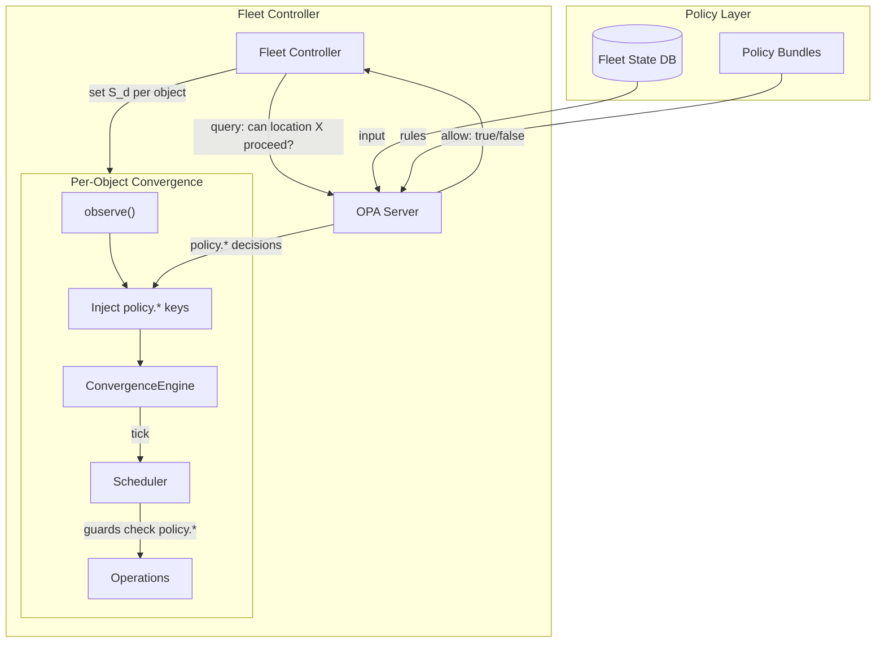
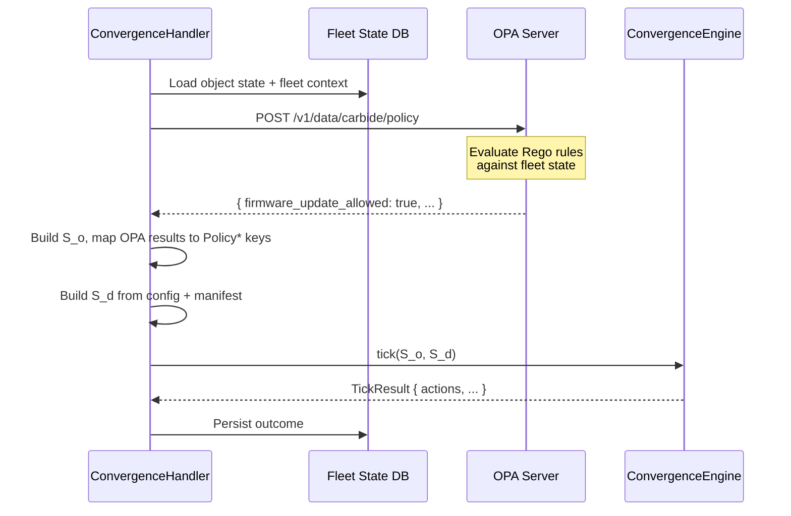

# External Policy — OPA / Rego

## 1. Motivation

The convergence engine (see [main specification](README.md)) operates at the level of a single object — one machine, one switch, one rack. Its scheduler selects operations based on the delta between observed and desired state, using guards, resource locks, and priority to make safe decisions.

However, many real-world constraints are **cross-object**:

- **Location-scoped firmware gating.** At most N machines per location (building, row, rack) may be updating firmware simultaneously, to preserve compute capacity.
- **Rack-level maintenance windows.** Firmware updates are only permitted during scheduled maintenance windows for a given rack.
- **Compliance enforcement.** A machine must not receive workloads unless its attestation status is `passed`.
- **Capacity preservation.** At least M healthy machines must remain in a rack during rolling updates.
- **Cross-object sequencing.** All DPUs in a rack must reach firmware version X before any host proceeds to the next phase.

These constraints cannot be expressed as guards within a single object's operations — they require visibility into the state of *other* objects. Rather than building a bespoke cross-object constraint system into the engine, we delegate external policy decisions to **Open Policy Agent (OPA)** using the **Rego** policy language.

### Why External Policy?

| Concern | Engine (internal) | Policy (external) |
|---------|-------------------|-------------------|
| **What** | How to converge a single object toward desired state | Whether/when an object is allowed to perform certain actions |
| **Scope** | Single object | Fleet-wide, location-wide, rack-wide |
| **Changed by** | Engineering (Rust code, profile modules) | Operations / SRE (Rego rules, config updates) |
| **Testing** | Unit tests against operation definitions | Rego unit tests against policy bundles |

Separating "how" (engine) from "when/whether" (policy) allows operators to modify fleet-wide constraints without redeploying the engine or changing profile modules.

---

## 2. Architecture

### 2.1 Integration Points

OPA integrates with the convergence engine at two points:



**Integration Point 1 — Pre-tick policy injection.** Before each convergence tick, a policy sidecar (or the `ConvergenceHandler` itself) queries OPA with the current fleet context. OPA evaluates its Rego rules and returns a set of **policy decisions** as key-value pairs. These are mapped to `StateKey` enum variants and set in the observed state:

```rust
PolicyFirmwareUpdateAllowed  = "true"
PolicyLocationLock           = "none"
PolicyMaintenanceWindowActive = "false"
PolicyCapacityHeadroom       = "3"
```

Guards in operation definitions reference these keys like any other `StateKey` variant:

```rust
and(eq(PowerState, "on"), eq(PolicyFirmwareUpdateAllowed, "true"))
```

**Integration Point 2 — Fleet controller gating.** The fleet controller (§6 of [main specification](README.md)) queries OPA before advancing rollout phases. For example:

```
Input:  { "location": "building-A", "phase": 1, "completed_count": 10, "total_count": 100 }
Output: { "allow_next_phase": true, "batch_size": 20 }
```

### 2.2 Data Flow

The full round-trip for a single convergence tick with policy:



---

## 3. Guard Integration

### 3.1 No Engine Changes Required

The key insight is that policy keys are just `StateKey` enum variants. The engine does not need to know that they come from OPA rather than hardware. The guard algebra evaluates `eq(PolicyFirmwareUpdateAllowed, "true")` exactly the same way it evaluates `eq(PowerState, "on")`.

This means:
- No new guard variants are needed.
- No engine code changes are needed.
- Policy keys participate in delta computation, dependency resolution, and anti-oscillation just like any other key.

### 3.2 Concrete Examples

**Firmware update gated by policy:**

```rust
op!(update_bmc_firmware {
    provides: [FirmwareBmcVersion],
    guard: and(
        eq(PowerState, "on"),
        neq(FirmwareBmcVersion, desired(FirmwareBmcVersion)),
        eq(PolicyFirmwareUpdateAllowed, "true"),
        eq(PolicyMaintenanceWindowActive, "true"),
    ),
    locks: [Firmware, Power],
    effects: [FirmwareBmcVersion => desired(FirmwareBmcVersion)],
    steps: [action(redfish_firmware_update, target = "bmc")],
    priority: 80,
});
```

**Attestation-gated workload assignment:**

```rust
op!(assign_instance {
    provides: [InstanceAssigned],
    guard: and(
        eq(AttestationStatus, "passed"),
        eq(PolicyWorkloadAssignmentAllowed, "true"),
    ),
    locks: [Instance],
    effects: [InstanceAssigned => "true"],
    steps: [action(create_instance)],
    priority: 50,
});
```

**Location-scoped power operation:**

```rust
op!(power_off_for_maintenance {
    provides: [PowerState],
    guard: and(
        eq(PowerState, "on"),
        eq(PolicyLocationPowerOffAllowed, "true"),
    ),
    locks: [Power],
    effects: [PowerState => "off"],
    steps: [action(redfish_power_off)],
    priority: 100,
});
```

### 3.3 Policy Key Conventions

| StateKey Variant | Description | Example Values |
|-----------------|-------------|----------------|
| `PolicyFirmwareUpdateAllowed` | Whether this object may perform firmware updates | `"true"`, `"false"` |
| `PolicyMaintenanceWindowActive` | Whether a maintenance window is currently active | `"true"`, `"false"` |
| `PolicyLocationLock` | Location-level lock status | `"none"`, `"firmware"`, `"power"` |
| `PolicyCapacityHeadroom` | Number of spare healthy machines in the rack | `"0"`, `"3"`, `"10"` |
| `PolicyWorkloadAssignmentAllowed` | Whether workload assignment is permitted | `"true"`, `"false"` |
| `PolicyRolloutPhase` | Current rollout phase for this object | `"0"`, `"1"`, `"2"` |
| `PolicyMaxConcurrentUpdates` | Max concurrent firmware updates at this location | `"5"`, `"10"` |

---

## 4. Rego Policy Examples

### 4.1 Location-Scoped Firmware Gating

At most 5 machines per location may be updating firmware simultaneously:

```rego
package carbide.policy

import future.keywords.if
import future.keywords.in

default firmware_update_allowed := false

firmware_update_allowed if {
    # Count machines currently updating firmware in this location
    location := input.machine.location
    updating := [m |
        some m in input.fleet.machines
        m.location == location
        m.state == "updating_firmware"
        m.id != input.machine.id
    ]
    count(updating) < input.policy.max_concurrent_firmware_updates
}
```

### 4.2 Maintenance Window Enforcement

Firmware updates are only permitted during scheduled maintenance windows:

```rego
package carbide.policy

import future.keywords.if
import future.keywords.in

default maintenance_window_active := false

maintenance_window_active if {
    some window in input.maintenance_windows
    window.location == input.machine.location
    time.now_ns() >= time.parse_rfc3339_ns(window.start)
    time.now_ns() <= time.parse_rfc3339_ns(window.end)
}
```

### 4.3 Attestation Compliance

Block workload assignment if attestation has not passed:

```rego
package carbide.policy

import future.keywords.if

default workload_assignment_allowed := false

workload_assignment_allowed if {
    input.machine.attestation_status == "passed"
    not input.machine.attestation_expired
}
```

### 4.4 Capacity Preservation

Ensure at least 3 healthy machines remain in a rack during updates:

```rego
package carbide.policy

import future.keywords.if
import future.keywords.in

default firmware_update_allowed := false

firmware_update_allowed if {
    rack_id := input.machine.rack_id

    healthy := [m |
        some m in input.fleet.machines
        m.rack_id == rack_id
        m.health == "healthy"
        m.state != "updating_firmware"
    ]

    count(healthy) > input.policy.min_healthy_per_rack
}
```

### 4.5 Cross-Object Sequencing

All DPUs in a rack must reach firmware version X before hosts proceed:

```rego
package carbide.policy

import future.keywords.if
import future.keywords.in
import future.keywords.every

default host_firmware_update_allowed := false

host_firmware_update_allowed if {
    rack_id := input.machine.rack_id
    target_version := input.policy.target_dpu_firmware_version

    dpus := [d |
        some d in input.fleet.dpus
        d.rack_id == rack_id
    ]

    every dpu in dpus {
        dpu.firmware_version == target_version
    }
}
```

---

## 5. OPA Deployment

### 5.1 Deployment Model

OPA runs as a **sidecar** alongside the Carbide API server (or as a shared service in the cluster). The deployment model:

```
┌─────────────────────────────────┐
│         Kubernetes Pod          │
│                                 │
│  ┌───────────┐  ┌────────────┐  │
│  │  Carbide  │  │    OPA     │  │
│  │   API     │──│  Sidecar   │  │
│  │  Server   │  │            │  │
│  └───────────┘  └─────┬──────┘  │
│                       │         │
│                  ┌────┴─────┐   │
│                  │  Policy  │   │
│                  │  Bundle  │   │
│                  │  Volume  │   │
│                  └──────────┘   │
└─────────────────────────────────┘
```

### 5.2 Bundle Distribution

Policy bundles are distributed as OCI artifacts or served from an HTTP endpoint:

1. Policy authors write Rego rules and unit tests.
2. Policies are packaged into an OPA bundle (tarball of `.rego` files + `data.json`).
3. Bundles are published to an OCI registry or S3-compatible store.
4. OPA pulls bundles periodically (configurable interval, typically 30s–60s).

### 5.3 Decision Logging

OPA's built-in decision logging is enabled to provide an audit trail:

- Every policy evaluation is logged with input, result, and timestamp.
- Decision logs are shipped to a log aggregation system for analysis.
- This enables post-hoc debugging: "why was machine X not allowed to update firmware at time T?"

### 5.4 Performance Considerations

| Concern | Mitigation |
|---------|-----------|
| **Latency** | OPA evaluates policies in-memory (microseconds). The sidecar deployment avoids network round-trips. |
| **Fleet state freshness** | Pre-compute fleet aggregates (counts per location, healthy machine counts) and cache in OPA's data store. Update on change, not per-query. |
| **Policy bundle size** | Keep policies modular. Only load policies relevant to the current deployment. |
| **Evaluation frequency** | Policy is evaluated once per tick (every ~30s per object). Even with thousands of objects, the total OPA load is manageable. |

---

## 6. Data Flow — Detailed

### 6.1 OPA Input Structure

The input document sent to OPA for each policy evaluation:

```json
{
  "machine": {
    "id": "machine-123",
    "location": "building-A-row-3",
    "rack_id": "rack-42",
    "hw_sku": "NVIDIA-GB300-XYZ",
    "state": "ready",
    "health": "healthy",
    "attestation_status": "passed",
    "firmware_version": "2.12.0",
    "power_state": "on"
  },
  "fleet": {
    "machines": [
      { "id": "machine-124", "location": "building-A-row-3", "state": "updating_firmware", "health": "healthy", "rack_id": "rack-42" },
      { "id": "machine-125", "location": "building-A-row-3", "state": "ready", "health": "healthy", "rack_id": "rack-42" }
    ],
    "dpus": [
      { "id": "dpu-001", "rack_id": "rack-42", "firmware_version": "24.04.1" }
    ]
  },
  "maintenance_windows": [
    { "location": "building-A-row-3", "start": "2026-04-05T02:00:00Z", "end": "2026-04-05T06:00:00Z" }
  ],
  "policy": {
    "max_concurrent_firmware_updates": 5,
    "min_healthy_per_rack": 3,
    "target_dpu_firmware_version": "24.04.1"
  }
}
```

### 6.2 OPA Output Structure

OPA returns a flat set of policy decisions:

```json
{
  "firmware_update_allowed": true,
  "maintenance_window_active": false,
  "workload_assignment_allowed": true,
  "capacity_headroom": 2,
  "location_lock": "none"
}
```

These are mapped to `StateKey` variants in the observed state:

```rust
PolicyFirmwareUpdateAllowed  = "true"
PolicyMaintenanceWindowActive = "false"
PolicyWorkloadAssignmentAllowed = "true"
PolicyCapacityHeadroom       = "2"
PolicyLocationLock           = "none"
```

---

## 7. Testing

### 7.1 Rego Unit Tests

Rego policies are unit-tested independently using OPA's built-in test framework:

```rego
package carbide.policy_test

import data.carbide.policy

test_firmware_allowed_under_limit {
    policy.firmware_update_allowed with input as {
        "machine": {"id": "m1", "location": "loc-A"},
        "fleet": {"machines": [
            {"id": "m2", "location": "loc-A", "state": "updating_firmware"},
            {"id": "m3", "location": "loc-A", "state": "ready"}
        ]},
        "policy": {"max_concurrent_firmware_updates": 5}
    }
}

test_firmware_blocked_at_limit {
    not policy.firmware_update_allowed with input as {
        "machine": {"id": "m1", "location": "loc-A"},
        "fleet": {"machines": [
            {"id": "m2", "location": "loc-A", "state": "updating_firmware"},
            {"id": "m3", "location": "loc-A", "state": "updating_firmware"},
            {"id": "m4", "location": "loc-A", "state": "updating_firmware"},
            {"id": "m5", "location": "loc-A", "state": "updating_firmware"},
            {"id": "m6", "location": "loc-A", "state": "updating_firmware"}
        ]},
        "policy": {"max_concurrent_firmware_updates": 5}
    }
}
```

Run with:

```bash
opa test -v policies/
```

### 7.2 Integration Testing with Mock Policy Keys

For integration testing the convergence engine with policy constraints, set mock policy keys directly in the observed state:

```rust
observed.set(StateKey::PolicyFirmwareUpdateAllowed, "false");
observed.set(StateKey::PolicyMaintenanceWindowActive, "true");

let result = engine.tick(&mut observed, &desired);

assert!(result.actions.iter().all(|a| a.id != Op::UpdateBmcFirmware));
```

This tests the engine's guard evaluation against policy keys without requiring a running OPA instance.

### 7.3 End-to-End Testing

For full end-to-end testing:

1. Start OPA with test policies loaded.
2. Seed fleet state in the test database.
3. Run a convergence tick for a test machine.
4. Verify that policy-gated operations are correctly allowed or blocked.
5. Modify fleet state (e.g., bring a machine offline) and re-run.
6. Verify that policy decisions change accordingly.

---

## 8. Alternatives Considered

### 8.1 Hardcoded Guards

**Approach:** Embed cross-machine constraints directly in operation guard expressions or engine code.

**Rejected because:**
- Guards operate on a single object's state — they cannot see other machines.
- Changing constraints requires redeploying the engine.
- No separation of concerns between engineering and operations.

### 8.2 Common Expression Language (CEL)

**Approach:** Use Google's CEL for policy evaluation.

**Trade-offs:**
- CEL is simpler than Rego — lower learning curve.
- But CEL lacks Rego's data-oriented features: partial evaluation, incremental compilation, built-in test framework, OPA ecosystem (decision logging, bundle distribution).
- CEL is better suited for simple validation rules, not fleet-wide constraint optimization.

**Decision:** Rego/OPA is preferred for its expressiveness, ecosystem maturity, and first-class support for data-driven policy decisions over collections.

### 8.3 Custom Policy DSL

**Approach:** Design a Carbide-specific policy language.

**Rejected because:**
- Significant engineering investment to design, implement, and maintain a language.
- No existing ecosystem (testing, debugging, documentation).
- OPA/Rego is a battle-tested CNCF project used by Kubernetes, Istio, and other infrastructure systems.

### 8.4 Database Queries / SQL

**Approach:** Express constraints as SQL queries against the fleet state database.

**Trade-offs:**
- SQL is familiar and powerful for aggregations.
- But SQL is not composable — complex policies become unwieldy nested queries.
- No built-in testing framework for policy logic.
- Tightly couples policy to database schema.

**Decision:** OPA with pre-computed aggregates in its data store provides the benefits of database-backed state without coupling policy to SQL.
